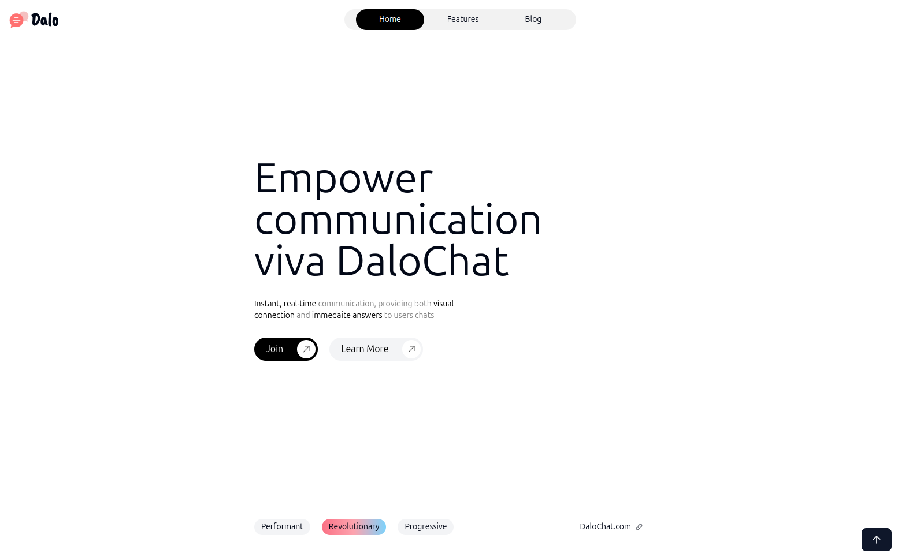
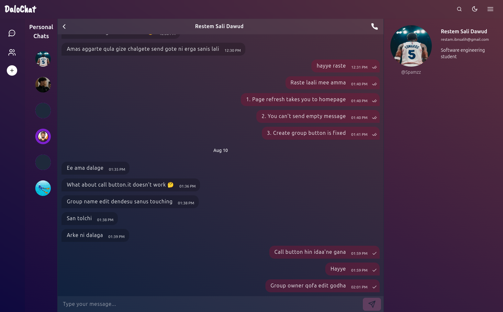
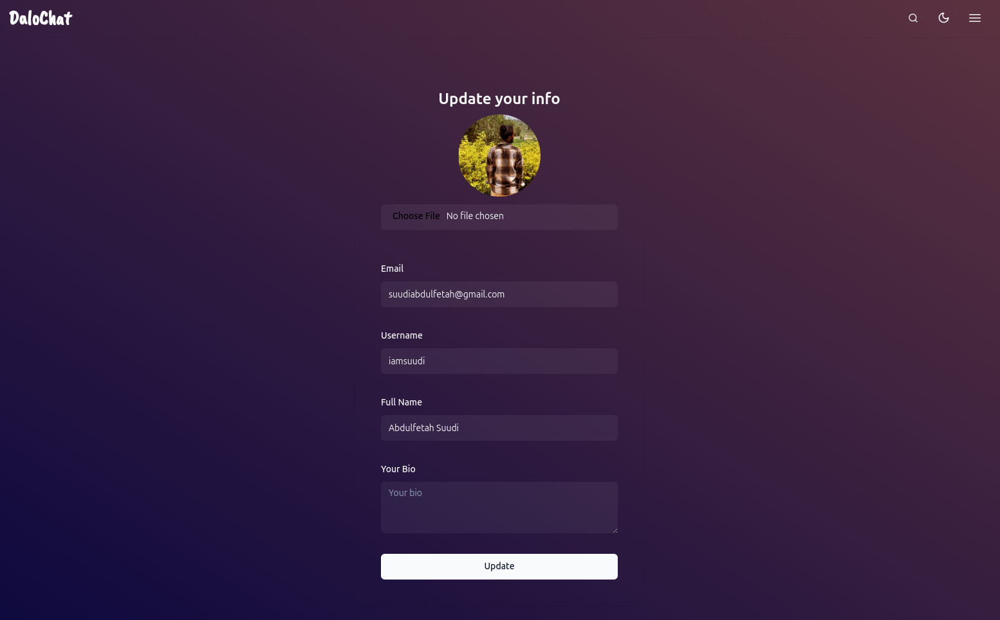

# DaloChat

Website: https://dalochat.onrender.com/

It's completely free, just login with a google account or signup with your email-password and try it out!

---

## Tech Stack

- **Front End:** React | TypeScript | TailwindCSS
- **Back End:** Express | Node | MongoDB
- **Other Libraries:** Shadcn UI | Zustand | TanStack

---

## Goal

My goal was to create an application where users can chat in groups or individual in real-time

---

## Key Features 

- Real-time update.

- End-to-end individual chat.

- Creating and managing groups.

- Profile update that supports image uploading.

- Deleting the messages we sent.

- Adding contacts using their usernames and Deleting chats.

- User authentication using Auth2.

- Interactive UI that is in sync with the database.

---

## What I learned

It was my first time moving bundled client code to the backend and serve html from the server. It is very fast compared to hosting react code separately.

I also learned that managing and scaling react-app gets more difficult as the app gets more complex. I have been using react-router for client side SPA routing and zustand for state management. Next.Js solves all the problems related to server components, SSR and built-in router. 

I used tanstack's react-query for server state managements which updates UI better than react's default useEffect. Socket.io for real-time connections is much better than Web Browser's websocket and all the datas are saved to mongodb atlas.

---

## Project Images

**Landing Page**

This is the landing page for my web application. I added some cool scroll animaions.



---

**Chat**

This is the individual chat section. As soon as you select a user the conversation will be shared between you in real time.



---

Profile Page




## Setup

Installation:

```bash
git clone git@github.com:iamsuudi/messaging-app.gi
```
---

Install Dependencies:

```bash
pnpm install
```
---

Running Client Dev Server:

```bash
cd client
pnpm dev
```
---

Running Api Dev Server:

```bash
cd api
pnpm dev
```

---

Running Prod Server:

If you have made changes in the client code, re-build it and move the dist folder to the api as follows:

```bash
cd client
pnpm build
mv -f dist/ ../api/
```
Then go to api directory and build it

```bash
cd api
pnpm build
pnpm start
```
